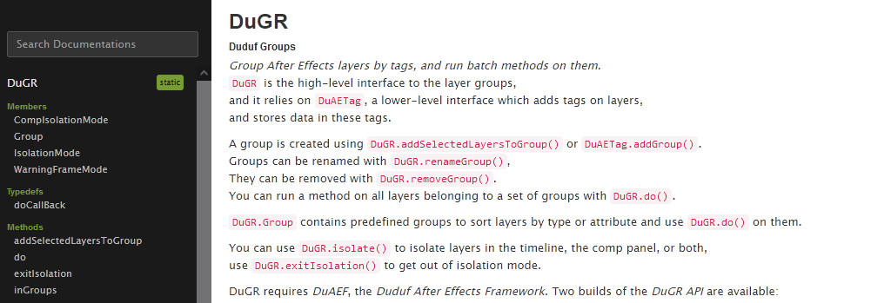

# The DuGR API

{: target="_blank" }

*DuGR*, as all the most recent scripts from [*RxLaboratory*](http://rxlaboratory.org) and [Duduf](http://duduf.com), provides a nice and easy-to-use *Scripting API*, along with the comprehensive *DuAEF - Duduf After Effects Framework*.

____

Builds and the source code of the *API* are [available on Github](https://github.com/RxLaboratory/DuAEF_DuGR); you can [**download the most recent builds** from the *releases* section](https://github.com/RxLaboratory/DuAEF_DuGR/releases).

Two builds of the *API* are released with each version of *DuGR*, starting with *4.0.0*.

- **`DuGR_api.jsxinc`** contains ***only*** the *API* without dependencies (*DuAEF* and possibly other requirements added later); use this when you plan to combine it with other *APIs* sharing *DuAEF* to include it only once.
- **`DuAEF_DuGR_api.jsxinc`** provides both the *DuGR API* and all its dependencies. It is easier to use if you only need *DuGR* as it  already includes all you need.

▹ [**Download the API**](https://github.com/RxLaboratory/DuAEF_DuGR/releases).

▹ Keep the [**comprehensive reference (dugr.rxlab.io)**](https://dugr.rxlab.io) under your pillow.

The [reference](https://dugr.rxlab.io) contains both the *DuGR* and all the *DuAEF* documentation as it is used, and extended, by *DuGR*.
____

**[This software is Free](license.md), as in "_free beer_" as well as in "_your freedom_ to use it as you wish".**

We need your help. Without your contributions, we can not continue our work to make the world a better place, by **protecting your freedom, far from mercantilism**.

► [**DONATE NOW!**](http://donate.rxlab.info){: target="_blank" }
