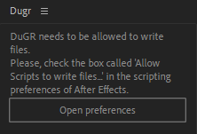
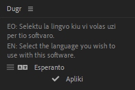

# How to install DuGR

## Supported versions of After Effects

DuGR is always developped and tested using __the two latest versions of *After Effects*__ and also **the current _Beta_ version** of *After Effects* and should work smoothly on these versions.

It is also known to be working decently on all previous versions back to *After Effects CC* from 2013.

!!! Warning
    All versions before and including *CS6* (2012 and before) will have issues running DuGR, and it will probably just not work at all, sorry! It’s time to update…

## Installation

### **1 -** Download *DuGR* from the [**official website**](http://rxlaboratory.org/tools/dugr).

### **2 -** **Unzip** the files you have downloaded.

You’ll find several folders and files.

- The `Help` folder contains these help pages. Double click on the file `index.html` to open it.
- The `ScriptUI Panels` folder contains the actual DuGR script you need to install.

### **3 -** There are several ways to easily **install** *DuGR*:  

#### a. Copy the files

Copy all the files from the *ScriptUI Panels* folder to:

- Windows: `C:/Program Files/Adobe/Adobe After Effects CC/Support Files/Scripts/ScriptUI Panels/`  
- Mac OS: `/Applications/Adobe After Effects CC/Scripts/ScriptUI Panels`

You may need administrator privileges to install Duik this way. If you don't have them, see the other ways below.

#### b. Using the menu for ***After Effects CC2019*** and more recent

- Open After Effects  
- Use the `File/Scritps/Install ScriptUI Panel...` menu to select and install `DuGR.jsx`.  

#### c. Shortcut for ***After Effects CC2018*** and more recent

- Open *After Effects*  
- *Windows*: Holding the `Alt` and `Shift` keys, drag and drop the file `DuGR.jsx` onto the Project panel.  
- *Mac OS*: Holding the `Options` and `Shift` keys, drag and drop the file `DuGR.jsx` onto the Project panel.  

### **4 - Restart** *After Effects* and *DuGR* will be available in the "Window" menu.

## Without installation 

You'll always be able to run DuGR without even installing it. This is a good way to use it if you do not have administrator privileges on an older version of *After Effects*.

- Unzip all the files in any folder.  
- Launch *After Effects*, and start *DuGR* via the `File/Scripts/Run script file...` menu.

## First Run

On first run, DuGR may first ask for file and network access, this is mandatory to make it work (DuGR needs to write its icon files, effects, settings, etc.).

Click on *Open Preferences* to go to the scripting preferences of *After Effects* and check the "Authorize file and network access" checkbox.

Then, *DuGR* will ask for the language you wish to use; it is set on [*Esperanto*](https://en.wikipedia.org/wiki/Esperanto){target="_blank"} by default, but many other languages are available.

Click on "Apliki" to apply the language you've chosen.

It can still be changed later in the [settings](settings.md) panel.
