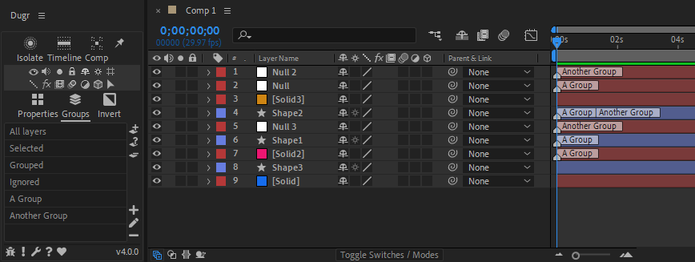
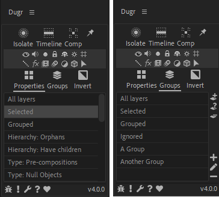
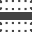
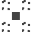
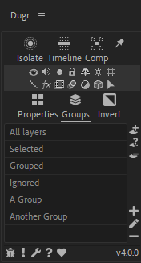

# DuGR Help

Dugr lets you to tag the layers so they belong to groups. Those groups are listed in the panel, and it is easy to isolate them in the composition, change their attributes, etc.

## Tabs and group lists

There are two tabs on the panel:

- {: style="width:20px;"} ***Properties*** allows you to select the layers by type, property or hierarchy.
- {: style="width:20px;"} ***Groups*** contains the list of tags/custom groups you've added.

You can select the group of layers you need to manipulate from these two lists.

The {: style="width:20px;"} ***Invert*** button can be used to manipulate layers **not** contained in the selected groups.

## Isolation

The top line buttons are toggles to isolate the layers belonging to the selected groups.

- {: style="width:20px;"} ***Isolate*** isolates the layer both in the timeline and the comp viewer panel. Layers outside of selected groups are both hidden and set to shy mode.
- {: style="width:20px;"} ***Timeline*** isolates the layer only in the timeline. Layers outside of selected groups are set to shy mode.
- {: style="width:20px;"} ***Comp*** isolates the layer only in the comp viewer panel. Layers outside of selected groups are hidden.
- {: style="width:20px;"} The *pin* button toggles the ***Interactive*** or ***Sticky*** mode. When checked, the isolation is updated as soon as you change the group selection. When disabled, you have to manually change the isolation mode after changing group selection. With heavy compositions containing a lot of layers, keeping it disabled improves the performance.

## Layer properties

The two middle lines of small icons can be used to quickly change the usual properties of the layers contained in the selected groups.

The extra {: style="width:12px;"} *arrow* icon selects the layers contained in the selected groups.

## Managing groups

!

On the ***custom groups tab***, a few extra buttons allow you to create, edit and remove groups.

### Layer buttons

- {: style="width:20px;"} ***Add selected layer*** to the current groups.
- {: style="width:20px;"} ***Select groups*** the current layers belong to.
- {: style="width:20px;"} ***Remove selected layers*** from the current group.

### Group buttons

- {: style="width:20px;"} ***Create group***.
- {: style="width:20px;"} ***Rename group***.
- {: style="width:20px;"} ***Remove group***.

### Bottom line icons

At the bottom line of the panel, a few icons are always there if you need them.

- {: style="width:20px;"} Post a ***Bug Report*** if something goes wrong.
- {: style="width:20px;"} Post a ***Feature Request*** if you have a good idea to share.
- {: style="width:20px;"} Go to the ***Settings panel*** to customize the script.
- {: style="width:20px;"} Come here if you need ***Help***.
- {: style="width:20px;"} Click this ***if you like*** *DuGR*!.